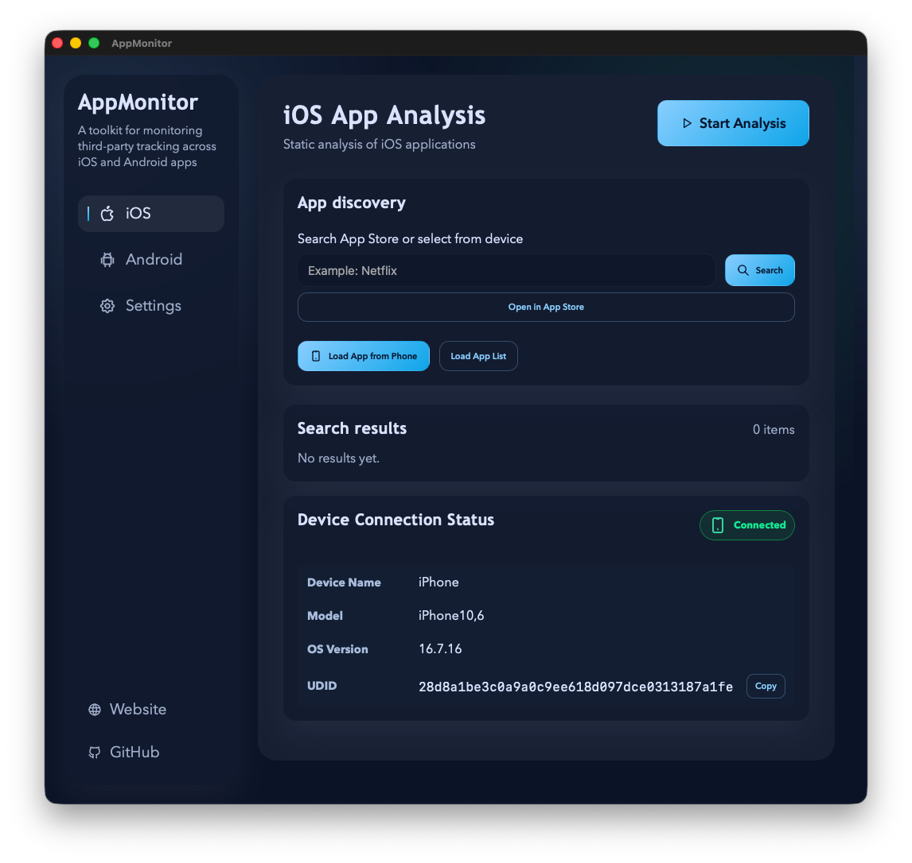

# AppMonitor

AppMonitor is a macOS desktop application for exploring iOS and Android apps
and identifying SDKs, permissions, and other app metadata relevant to
third-party tracking research.

## Using the GUI

AppMonitor's normal workflow is:

1. Connect a supported iPhone over USB and open AppMonitor.
2. Complete the guided SSH key setup the first time AppMonitor connects.
3. Select an app from the connected phone or search for an app in the store.
4. Start analysis and review the generated report.

For an iOS app that is already installed, choose whether to analyze that
installed copy with `am_scanner` only, install the latest version, or cancel.
Choosing the installed copy skips the Frida pass. Installing the latest version
runs `am_scanner` followed by the retained Frida analysis. The `am_scanner`
package must already be installed on the iPhone. See the
[iOS device setup](guides/ios-device-setup.md),
[am_scanner setup](guides/am-scanner.md), and
[Frida guide](guides/frida.md).

AppMonitor can prepare some downloaded IPAs for older iOS versions. Apps
declaring a minimum iOS version above 18.x are unsupported by this
compatibility flow. See the [IPA compatibility guide](scripts/prune_install_README.md).

App behavior can vary by device, iOS version, and jailbreak. Some apps may
refuse to launch or provide incomplete runtime evidence.

### Guides

- [iOS device, jailbreak, and SSH setup](guides/ios-device-setup.md)
- [Installing and deploying am_scanner](guides/am-scanner.md)
- [Frida setup and experimental analysis](guides/frida.md)
- [Standalone CLI usage](guides/cli.md)
- [Building AppMonitor from source](guides/development.md)

## Methodology

AppMonitor combines static evidence and permission metadata to identify known
SDKs and app capabilities. iOS analysis uses on-device `am_scanner` evidence;
the optional Frida path performs additional runtime instrumentation. Android
analysis uses its separate analysis workflow.

For detailed methodology, see *Monitoring infrastructural power:
Methodological challenges in studying mobile infrastructures for
datafication* by Lomborg, S., Sick Svendsen, K., Flensburg, S., & Sophus Lai,
S. (2024): [publication information](https://example.com).

## Citation

If you use this software, please cite the provided research paper.

## Affiliations and funding

This repository and its software components are part of the Datafied Living
Project and have received funding from the European Research Council (ERC)
under the European Union's Horizon 2020 research and innovation programme
[Datafied Living at the University of Copenhagen](https://datafiedliving.ku.dk/)
(Grant agreement ID: 947735) and the Horizon ERC 2024 Proof of Concept
[AppMonitor](https://cordis.europa.eu/project/id/101189401) (Grant agreement
ID: 101189401).

## License

This repository is licensed under Creative Commons Attribution 4.0
International (CC BY 4.0).
